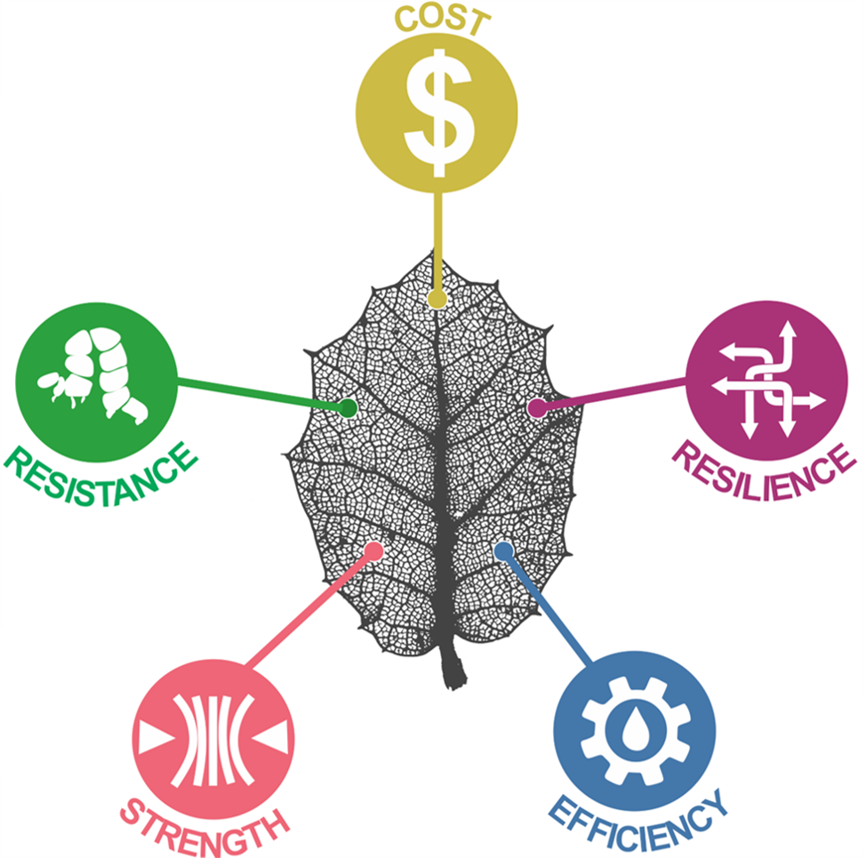
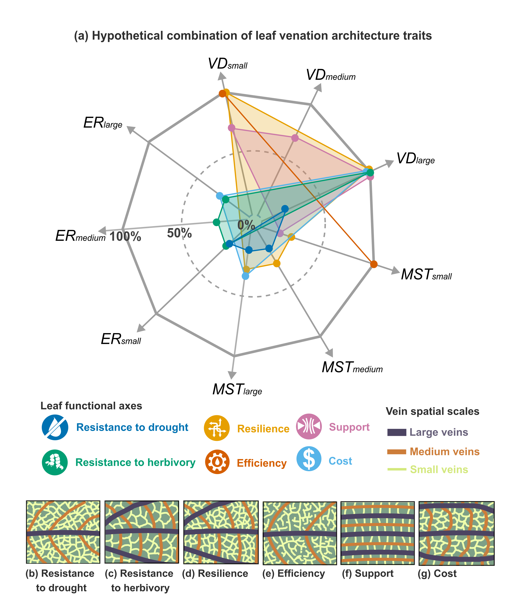
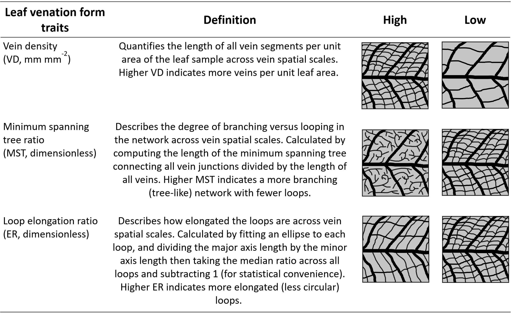
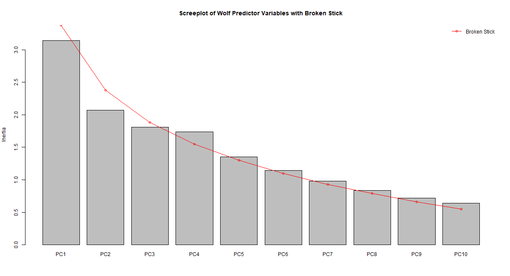

<!-- Improved compatibility of back to top link: See: https://github.com/othneildrew/Best-README-Template/pull/73 -->
<a name="readme-top"></a>
<!--
*** Thanks for checking out the Best-README-Template. If you have a suggestion
*** that would make this better, please fork the repo and create a pull request
*** or simply open an issue with the tag "enhancement".
*** Don't forget to give the project a star!
*** Thanks again! Now go create something AMAZING! :D
-->


<!-- PROJECT SHIELDS -->
<!--
*** I'm using markdown "reference style" links for readability.
*** Reference links are enclosed in brackets [ ] instead of parentheses ( ).
*** See the bottom of this document for the declaration of the reference variables
*** for contributors-url, forks-url, etc. This is an optional, concise syntax you may use.
*** https://www.markdownguide.org/basic-syntax/#reference-style-links
-->


<!-- PROJECT LOGO -->
<br />
<div align="center">
  <a href="https://github.com/ilamatos/venation_tradeoffs">
    
  </a>

<h3 align="center">Leaf venation form versus function trade-offs</h3>

  <p align="center">
   Data and Rcode to reproduce analysis of the manuscript entitled "Leaf venation network architecture coordinates functional trade-offs across vein spatial scales"
    <br />
    <a href="https://github.com/ilamatos/xylem_implosion_safety"><strong>Explore the docs »</strong></a>
    <br />
    <br />
    <a href="https://github.com/ilamatos/xylem_implosion_safety">View Demo</a>
    ·
    <a href="https://github.com/ilamatos/xylem_implosion_safety/issues">Report Bug</a>
    ·
    <a href="https://github.com/ilamatos/xylem_implosion_safety/issues">Request Feature</a>
  </p>
</div>


<!-- TABLE OF CONTENTS -->
<details>
  <summary>Table of Contents</summary>
    <li>
      <a href="#about-the-project">About the project </a>
      </ul>
   <li>
      <a href="#statistical-analysis">Statistical Analysis</a>
    </ul>
   <li>
      <a href="#leaf-venation-form-traits">Leaf traits</a>
    </ul>
    <li>
      <a href="#getting-started">Getting Started</a>
      </ul>
        <li><a href="#prerequisites">Prerequisites</a></li>
        <li><a href="#installation">Installation</a></li>
      </ul>
    </li>
    <li><a href="#contact">Contact</a></li>
    <li><a href="#references">References</a></li>
  </ol>
</details>


<!-- ABOUT THE PROJECT -->
## About The Project
Leaf venation networks may contribute to at least four functional axes: 

- Flow efficiency: how efficiently water flows through the leaf;
- Damage resistance: ability to avoid physical and hydraulic damages that reduce flow across the leaf;
- Damage resilience: capacity to maintain flow through the leaf after physical or hydraulic damage has occurred;
- Mechanical support: leaf capacity to remain upright in space.

All those functions must be traded off against the construction cost of the leaf. Due to biophysical and physiological constraints it might be impossible to construct a leaf network that simultaneously maximizes all those functions, while also minimizing costs (Blonder et al., 2020, 2018). Thus, plants may have found different solutions (i.e. different network forms) to maximize some functions to the detriment of others, depending on the selective forces under which they have evolved.

Features not related to the venation network (e.g. mesophyll conductance, chemical defenses) also influence leaf functions/costs, and may covary, cancel out, or reinforce the venation form versus function trade-offs. Quantifying the contribution of network form features to different leaf functions is therefore essential to understand the biophysical constraints that drove the evolution of plants with diverse network architectures. 

In this study, we obtained leaf venation form and functional traits from a phylogenetic diverse set of 122 plant species (in 112 families, including ferns, basal angiosperms, monocots, basal eudicots, asterids, and rosids), which allowed a deeper investigation of how venation form versus function trade-offs vary across taxa. Our functional dataset included ten traits (see below) and provided a more complete description of the five functional/cost axes. Our architectural multiscale dataset was extracted from fully segmented leaf images, including all veins between 10 and 500 𝜇m, and supported an accurate representation of how key vein features (see below), such as vein density, vein ramification (branching vs. looping) and shape of loops (circular vs. elongated), vary across the entire venation network. By combining those two datasets we were able to (1) quantify the total contribution of network form features to determine each leaf function; (2) identify which form traits are more important to determine each function; (3) assess how pairwise interactions between venation form traits influence each function; and (4) test several specific hypothesis relating leaf venation form and functional traits (see Figure 1). 

<!-- FIGURE 1 -->
<br />
<div align="left">
  <a href="https://github.com/ilamatos/venation_tradeoffs">
    
  </a>

<h3 align="left">Figure 1</h3>
Hypothetical tradeoffs between leaf venation function (flow efficiency, damage resistance, damage resilience, mechanical support, construction cost) and form traits (vein density - VD, minimum spanning tree ratio - MST, loop elongation ratio - ER) across vein spatial scales (minor, medium, major). (a) Damage resistance to drought is higher in networks with lower density (low VD) of major veins and more circular (low ER) loops in medium and minor veins; while resistance to herbivory is higher in networks with higher vein density (high VD) and more circular (low ER) loops in medium and minor veins; (b)  Damage resilience to drought and herbivory is higher in networks with higher density (high VD) of circular looping (low MST and ER) veins; (c) Flow efficiency is higher in networks with  higher density (high VD) of branching (high MST) minor veins; (d) Mechanical support is  higher in networks with higher density (high VD) of looping (low MST) veins; and (e) Construction cost is higher in networks with higher density (high VD) of circular looping (low MST and ER) veins. Panels (a) to (e) illustrate an hypothetical leaf whose network architecture maximizes each function/cost. Minor, medium, and major veins are represented by red, blue, and yellow lines, respectively.

<p align="left">(<a href="#readme-top">back to top</a>)</p>

<!--LEAF TRAITS -->
## Leaf venation functional traits
- Flow efficiency:
 ```sh
- Kleaf max (mmol m-2 s-1 MPa-1): Maximum leaf hydraulic conductance. Describes how much water flows across the leaf in response to a water potential gradient between the leaf and the surrounding atmosphere. Higher Kleaf max indicates a higher flow efficiency.                          
 ```
- Damage resistance - drought:
 ```sh
- P50 (-MPa): Leaf water potential inducing 50% loss of Kleaf max. Lower (more negative) P50 indicates a higher damage resistance to drought.
- P88 (-MPa): Leaf water potential inducing 88% loss of Kleaf max. Lower (more negative) P88 indicates a higher damage resistance to drought.
- ISI (dimensionless): Xylem conduit implosion safety index. Measures the xylem cell walls resistance to implosion during drought. The thicker the double cell wall relative to its maximum diameter (higher ISI), the greater the resistance to drought.                                          
```
- Damage resistance - herbivory:
 ```sh
 - SWP (kJ m-2 m-1): Specific work to punch. Measures the absolute amount of work done to punch a leaf through its midrib (SWP midrib) or lamina (SWP lamina) per unit of leaf width. Higher SWP indicates a higher mechanical resistance against herbivores.
 - SWS (J m-2): Specific work to shear. Measures the absolute amount of work done to shear the leaf midrib (SWS midrib) or lamina (SWS lamina) per unit of leaf width. Higher SWS indicates a higher mechanical resistance against herbivores.
- Phe (g g-1): total phenol content in dried leaves quantified using the Folin–Ciocalteu (F–C) assay. Phe can be used as a partial proxy (as there are other potential leaf chemical defense compounds besides phenolic ones) of chemical defense against herbivores. Higher Phe values indicate higher damage resistance.                                                                                                                   
```
- Damage resilience - drought and herbivory:
 ```sh
 - ∆Kleafmean (%): Average change in Kleaf after simulated herbivory in the leaf midrib and lamina. The percentage decrease (∆Kleaf <0) or increase (∆Kleaf >0) in the leaf hydraulic conductance 48 hours after the leaf midrib and lamina has been physically damaged. Higher ∆Kleaf mean indicates a higher resilience.                       
 ```
- Mechanical support:
 ```sh
-  ε (MN m-2): Leaf flexural modulus of elasticity. Measures the whole  leaf  (ε whole) or leaf lamina (ε lamina) resistance to deformation from bending forces. Higher ε (stiffer leaves) indicates a higher mechanical support.                                                      
 ```
- Construction cost:
 ```sh
- LMA (kg m-2): Leaf mass per area. Describes the amount of resources invested on the construction of each unit of leaf area (Pérez-Harguindeguy et al., 2016). Higher LMA indicates a higher construction cost.                                                                                               
 ```    
## Leaf venation form traits

<!-- FIGURE 2 -->
<br />
<div align="left">
  <a href="https://github.com/ilamatos/venation_tradeoffs">
    
  </a>

<!-- STATISTICAL ANALYSIS -->
## Statistical analysis

To assess evidence for variation in venation form versus function trade-offs across vein spatial scales and plant phylogeny, we used two complementary approaches: principal component analysis (PCA) and gradient boosting regression models (GBMs). 

In our first approach, we carried out a PCA with all leaf traits (form and functional traits) to evaluate whether species in different clades and/or veins at different spatial scales occupy different portions of the form-function space. Prior to the PCA we imputed missing values in the functional dataset using a Bayesian hierarchical probabilistic matrix factorization (BHPMF; Schrodt et al., 2015). BHPMF imputes values based on both the phylogenetic tree (taxonomic hierarchy) and the correlation structure within the matrix of species trait values. The multiscale venation statistics (VD, ER, MST) were binned into 50 r min bins spanning 0.01 mm (r min < 0.01 mm, veins too small to be distinguishable in our cleared leaf images) to 0.5 mm (r min > 0.5 mm, too few veins sampled at this size). After the imputation and binning, all trait values were centered and scaled (z-transformed) to improve comparability among them and to reduce bias towards traits with higher variance. VD and ER values were also sqrt-transformation to improve normality. Then, we ran the PCA and used the broken stick method for estimating the number of statistically significant principal components to be retained. We visualized the retained principal component scores using 95% confidence ellipses at each clade and also at each vein spatial scale (i.e. at each  rmin bin).

In our second approach, we fitted GBM models to quantify the contribution of  different network form features to determine each leaf function. GBM is a forward machine-learning ensemble method that combines the predictions from various weak learner models and builds a final predictive model with a more accurate estimate of the response variable. Unlike traditional regression models, GBMs are robust to outliers, and can effectively capture complex non-linear interactions between predictor variables (Natekin and Knoll, 2013). 

GBM models were fitted using one leaf functional trait (P50, P88, ISI, SWP midrib, SWP lamina, SWS midrib, SWS lamina, ∆Kleaf mean, Kleaf max, 𝜀 whole, 𝜀 lamina, LMA, Phe) at a time as the response variables, and clade (ferns, basal angiosperms, monocots, basal eudicots, rosids, asterids) plus the three venation form traits (VD, MST, ER) as predictor variables. To facilitate the interpretation of model results, we coded the categorical variable ‘clade’ using numbers from 1 (= ferns) to 6 (=asterids). We also binned the venation form traits into three bins to represent major, medium, and minor veins. Because not all leaves have veins of the exact same size, we first standardize r min within each species (by dividing each r min value by the maximum r min for each species), so that r min across all species varied from 0 to 1. After this standardization, we classified r min values into minor (0 < r min ≤ 0.3), medium  (0.3 < r min ≤ 0.6) and major veins (r min > 0.6), and calculated the median VD, MST and ER for each bin. As the venation form traits were extracted from whole-leaf networks we considered any absences of veins at a certain scale as true absences (Blonder et al., 2020), and assigned a median value of zero in those cases. To fit each GBM, we split data 80:20 between training and test. Then, we used H2O’s Automatic Machine Learning function h2o.automl as implemented in the h2o R-package to perform a hyperparameter search over the GBM parameters in order to deliver the best model for each functional trait. To prevent model overfit, our hyperparameter tuning was done with a maximum running time of 30 seconds and a 3-fold cross validation. Model performance was assessed using the Root Mean-Square Error (RMSE). From each best model, we obtained the total variance explained, the influence of each predictor variable, and the strength of pairwise interactions between them. The influence of each predictor variable was assessed using both permutation variable importance and magnitude of variable attributions (SHapley Additive exPlanations -SHAP values, Štrumbelj and Kononenko, 2014). Variable importance, ranging from 0 (lowest importance) to 1 (highest importance), was determined using the h2o.varimp function, which measures the increase in the prediction error of the model (RMSE) after variable values are permuted. SHAP values were determined using h2o.predict_contributions function, which measures the impact of every variable on the prediction by the model for each specific instance of the data, so that variables with large absolute SHAP values are more important. The strength of the pairwise interactions was calculated as the H-statistic (Friedman and Popescu, 2008) using the function Interaction$new from the iml (Interpretable Machine Learning) R-package. H-statistic measures how much of the variation of the predicted outcome depends on a given pairwise interaction between predictor variables, and varies from 0 (no interaction) to 1 (100% of variance is due to interactions). Due to the low sample size (N = 32), GBM models for P50 and P88 were fitted using the BHPMF-imputed data, for all other response variables the original (non-imputed) functional trait dataset was used.

Kruskal wallis tests followed by pairwise Wilcox tests with Benjamini and Hochberg (1995) p-value adjustment method were conducted to test for differences in the leaf functional traits across plant clades, and also to test our specific hypothesis that resilience (𝛥Kleaf mean) varies across venation types (parallel, palmate, pinnate).

All analyses were carried out using the R version 4.3.1.


<!-- GETTING STARTED -->
## Getting Started

### Prerequisites

You will need R version 4.3.1 (or greater) and the following R-packages installed and loaded in your computer to run the Rcode to reproduce the analysis of this project

### Installation

1. Clone the repo
   ```sh
   git clone https://github.com/ilamatos/venation_tradeoffs.git
   ```
2. Install the necessary R-packages
   ```sh
   install.packages(c("tidyverse", "magrittr", "ggpubr", "vegan", "ggrepel", "viridis", "data.table", "iml"))
   ```
3. Some packages may need to be installed from the source
   
```sh
  # Install BHPMF R-package
  packageurl <- "https://cran.r-project.org/src/contrib/Archive/BHPMF/BHPMF_1.0.tar.gz"
  install.packages(packageurl, repos=NULL, type="source
  
  # Install h2o R-package 
  install.packages("C:/Users/ilain/Downloads/h2o-3.42.0.3/h2o-3.42.0.3/R/h2o_3.42.0.3.tar.gz",
                   repos = NULL, type = "source")
   ```
4. Run the R-scripts following the order below
 * []()"1_prepare_functional_data.R"
 * []()"2_prepare_form_data.R"
 * []()"3_pca_analysis.R"
 * []()"4_gbm_analysis.R"


<p align="right">(<a href="#readme-top">back to top</a>)</p>

<!-- PCA  -->
## Principal component analysis (PCA)

Import dataset and run the PCA
```sh
# Import datasets ---------
data_for_pca<- read_csv("data/data_for_pca.csv")
glimpse(data_for_pca)

# Run PCA -----------------
pca_all <- prcomp(data_for_pca%>%select_if(.,is.numeric)%>%
                    select(-rmin_binned, -Dkleaf_M, -Dkleaf_L, -CR.median), # removing variables not for pca
                  center=TRUE, # center data
                  scale=TRUE) # z-transform data
```
Use the Broken-stick method to determine the number of principal components (PCs) to be retained

```sh
screeplot(pca_all, main = "Screeplot of Wolf Predictor Variables with Broken Stick", bstick=TRUE, type="barplot")
```
<!-- FIGURE 2 -->
<br />
<div align="left">
  <a href="https://github.com/ilamatos/venation_tradeoffs">
    
  </a>

<h3 align="left">Figure 2</h3>
Eigenvalues (grey bars) for each principal component (PC) with null model values generated by the broken stick model (red broken line). The point at which the eigenvalues cross the broken stick model distribution is considered to indicate the maximum number of components to retain.

In this case, we retain the 3 first PCs.

```sh
# extract PCA scores
pca_trajectories <- data.frame(clade=as.factor(data_for_pca$clade),
                               code=as.factor(data_for_pca$spp_code), 
                               rmin=data_for_pca$rmin_binned, 
                               pca_all$x[,c(1,2,3)])
# get axes
pca_rotations = as.data.frame(pca_all$rotation[,1:2])
pca_rotations$var = row.names(pca_rotations)
pca_rotations$x0 = 0
pca_rotations$y0 = 0
row.names(pca_rotations) = NULL
scale_factor = 10
```
Visualize the retained principal component scores using 95% confidence ellipses at each clade and also at each vein spatial scale (i.e. at each  rmin bin)

```sh
g_pca_clade1 <- ggplot(pca_trajectories %>% mutate(clade.factor=clade),
                       aes(x=PC1, y=PC2,col=clade.factor,group=clade.factor)) + 
  geom_point(size = 1.5, alpha = 0.1) + 
  stat_ellipse(size =0.5, alpha = 0.8) + 
  geom_segment(data=pca_rotations,aes(x=x0,y=y0,xend=scale_factor*PC1,yend=scale_factor*PC2),inherit.aes = FALSE,size=0.5,color='grey20') +
  geom_text_repel(data=pca_rotations,aes(x=scale_factor*PC1,y=scale_factor*PC2, label = var),inherit.aes = FALSE,size=4,color='black',
                  box.padding = 0.5, max.overlaps = Inf, nudge_x = -0.1, direction = "x") +  
  theme_bw() +
  xlab(sprintf("PC1 (%.2f%%)",varexp[1])) +
  ylab(sprintf("PC2 (%.2f%%)",varexp[2])) +
  scale_fill_manual(values = c("asterids"="#D55E00",# dark orange
                               "rosids"="#CC79A7", # pink
                               "basal angiosperms" = "#0072B2", #dark blue
                               "monocots" = "#009E73",# green
                               "basal eudicots" = "#F0E442",#yellow
                               "ferns" = "#999999")) +
  scale_color_manual(values = c("asterids"="#D55E00",# dark orange
                                "rosids"="#CC79A7", # pink
                                "basal angiosperms" = "#0072B2",#dark blue
                                "monocots" = "#009E73",# green
                                "basal eudicots" = "#F0E442",#yellow
                                "ferns" = "#999999"), name = "Clades",
                     breaks=c('ferns', 'basal angiosperms', 'monocots', 'basal eudicots', 'rosids', 'asterids'))+
  theme(axis.text = element_text(size = 14),
        axis.title = element_text(size = 14),
        legend.title = element_text(size=14),
        legend.text = element_text(size=14),
        legend.position="right");g_pca_clade1


# overall PCA space - by rmin PC1 x PC2
g_pca_rmin1 <- ggplot(pca_trajectories %>% mutate(rmin.factor=rmin),
                      aes(x=PC1, y=PC2,col=rmin.factor,group=rmin.factor)) + 
  geom_point(size = 1.5, alpha = 0.1) + 
  stat_ellipse(size =0.5, alpha = 0.8) + 
  geom_segment(data=pca_rotations,aes(x=x0,y=y0,xend=scale_factor*PC1,yend=scale_factor*PC2),inherit.aes = FALSE,size=0.5,color='grey20') +
  geom_text_repel(data=pca_rotations,aes(x=scale_factor*PC1,y=scale_factor*PC2,label=gsub("\\.median","",var)),inherit.aes = FALSE,size=4,color='black',
                  box.padding = 0.5, max.overlaps = Inf, nudge_x = -0.1, direction = "x") +    
  theme_bw() +
  xlab(sprintf("PC1 (%.2f%%)",varexp[1])) +
  ylab(sprintf("PC2 (%.2f%%)",varexp[2])) +
  scale_fill_viridis(name=expression(paste("r"["min"], " (mm)"))) +
  scale_color_viridis(name=expression(paste("r"["min"], " (mm)")))+
  theme(axis.text = element_text(size = 14),
        axis.title = element_text(size = 14),
        legend.title = element_text(size=14),
        legend.text = element_text(size=14), 
        legend.key.size = unit(1, 'cm'),
        legend.position="bottom");g_pca_rmin1 

g_pca1<-ggarrange(g_pca_clade1, g_pca_rmin1,
                  common.legend=F,legend='right',
                  align='hv',
                  nrow=2,ncol=1,
                  labels=c("(a)", "(b)"));g_pca1
```
<!-- FIGURE 3 -->
<br />
<div align="left">
  <a href="https://github.com/ilamatos/venation_tradeoffs">
    
  </a>

<h3 align="left">Figure 3</h3>
Eigenvalues (grey bars) for each principal component (PC) with null model values generated by the broken stick model (red broken line). The point at which the eigenvalues cross the broken stick model distribution is considered to indicate the maximum number of components to retain.

<!-- CONTACT -->
## Contact

Ilaine Silveira Matos - ilaine.matos@gmail.com

Project Link: [https://github.com/ilamatos/venation_tradeoffs](https://github.com/ilamatos/venation_tradeoffs)

<p align="right">(<a href="#readme-top">back to top</a>)</p>

<!-- REFERENCES -->
## References

* []()Benjamini Y and Hochberg Y (1995) Journal of the Royal Statistical Society Series B
* []()Blonder B et al (2020) New Phytologist
* []()Blonder B et al (2018) Journal of Ecology
* []()Friedman JH and Popescu BE (2008) Annals of Applied Statistics
* []()Natekin A and Knoll A (2013) Frontiers in Neurorobotics
* []()Schrodt F (2015) Global Ecology and Biogeography
* []()Štrumbelj E and Kononenko I (2014) Knowledge and Information Systems 
<p align="right">(<a href="#readme-top">back to top</a>)</p>


<!-- MARKDOWN LINKS & IMAGES -->
<!-- https://www.markdownguide.org/basic-syntax/#reference-style-links -->
[contributors-shield]: https://img.shields.io/github/contributors/ilamatos/xylem_implosion_safety.svg?style=for-the-badge
[contributors-url]: https://github.com/ilamatos/xylem_implosion_safety/graphs/contributors
[forks-shield]: https://img.shields.io/github/forks/ilamatos/xylem_implosion_safety.svg?style=for-the-badge
[forks-url]: https://github.com/ilamatos/xylem_implosion_safety/network/members
[stars-shield]: https://img.shields.io/github/stars/ilamatos/xylem_implosion_safety.svg?style=for-the-badge
[stars-url]: https://github.com/ilamatos/xylem_implosion_safety/stargazers
[issues-shield]: https://img.shields.io/github/issues/ilamatos/xylem_implosion_safety.svg?style=for-the-badge
[issues-url]: https://github.com/ilamatos/xylem_implosion_safety/issues
[license-shield]: https://img.shields.io/github/license/ilamatos/xylem_implosion_safety.svg?style=for-the-badge
[license-url]: https://github.com/ilamatos/xylem_implosion_safety/blob/master/LICENSE.txt
[linkedin-shield]: https://img.shields.io/badge/-LinkedIn-black.svg?style=for-the-badge&logo=linkedin&colorB=555
[linkedin-url]: https://linkedin.com/in/linkedin_username
[product-screenshot]: images/screenshot.png
[Next.js]: https://img.shields.io/badge/next.js-000000?style=for-the-badge&logo=nextdotjs&logoColor=white
[Next-url]: https://nextjs.org/
[React.js]: https://img.shields.io/badge/React-20232A?style=for-the-badge&logo=react&logoColor=61DAFB
[React-url]: https://reactjs.org/
[Vue.js]: https://img.shields.io/badge/Vue.js-35495E?style=for-the-badge&logo=vuedotjs&logoColor=4FC08D
[Vue-url]: https://vuejs.org/
[Angular.io]: https://img.shields.io/badge/Angular-DD0031?style=for-the-badge&logo=angular&logoColor=white
[Angular-url]: https://angular.io/
[Svelte.dev]: https://img.shields.io/badge/Svelte-4A4A55?style=for-the-badge&logo=svelte&logoColor=FF3E00
[Svelte-url]: https://svelte.dev/
[Laravel.com]: https://img.shields.io/badge/Laravel-FF2D20?style=for-the-badge&logo=laravel&logoColor=white
[Laravel-url]: https://laravel.com
[Bootstrap.com]: https://img.shields.io/badge/Bootstrap-563D7C?style=for-the-badge&logo=bootstrap&logoColor=white
[Bootstrap-url]: https://getbootstrap.com
[JQuery.com]: https://img.shields.io/badge/jQuery-0769AD?style=for-the-badge&logo=jquery&logoColor=white
[JQuery-url]: https://jquery.com 
